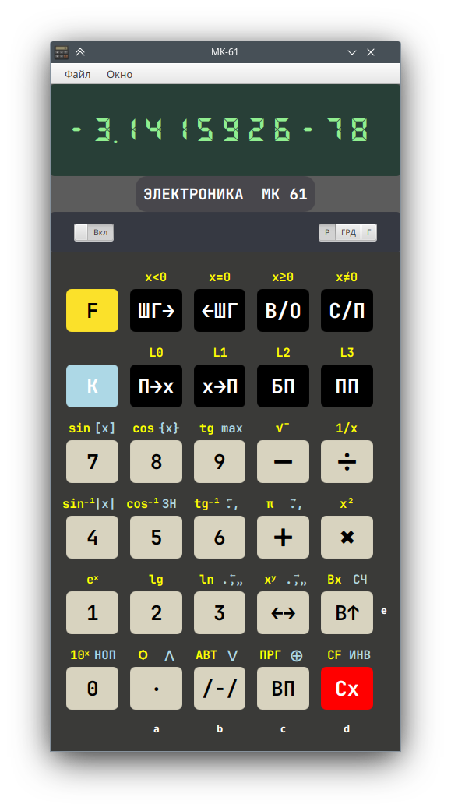
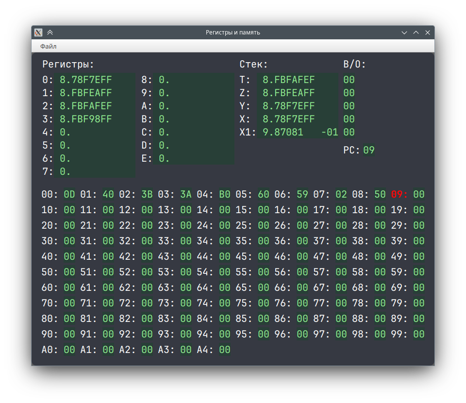

# МК-61


[](LICENSE)

Эмулятор программируемого микрокалькулятора МК-61.

Ядро эмулятора взято из проекта [https://github.com/cax/pmk-android](https://github.com/cax/pmk-android)



## Регистры и память



На данный момент реализовано сохранение и загрузка дампа программной памяти
в простой текстовый файл.

С помощью внешнего редактора в файл с дампом можно добавлять комментарии, начинающиейся с ```#```.  
Комментарии не сохраняются при перезаписи файла из эмулятора.

<details>

<summary>Пример</summary>

```text
# Программа 3.7. [Дьяконов, стр. 138]
# Перевод целых чисел Nm с основанием m=10 в числа Nn с другим основанием n и наоборот
# Ввод: m = R0, n = R1, Nm = RX
#
54 01 42 0D 14 0E 61 13 01 10
43 D3 25 25 63 61 12 11 62 12 
10 62 60 12 42 25 63 5E 05 25 
50 00 00 00 00 00 00 00 00 00 
00 00 00 00 00 00 00 00 00 00 
00 00 00 00 00 00 00 00 00 00 
00 00 00 00 00 00 00 00 00 00 
00 00 00 00 00 00 00 00 00 00 
00 00 00 00 00 00 00 00 00 00 
00 00 00 00 00 00 00 00 00 00 
00 00 00 00 00 
```
</details>
