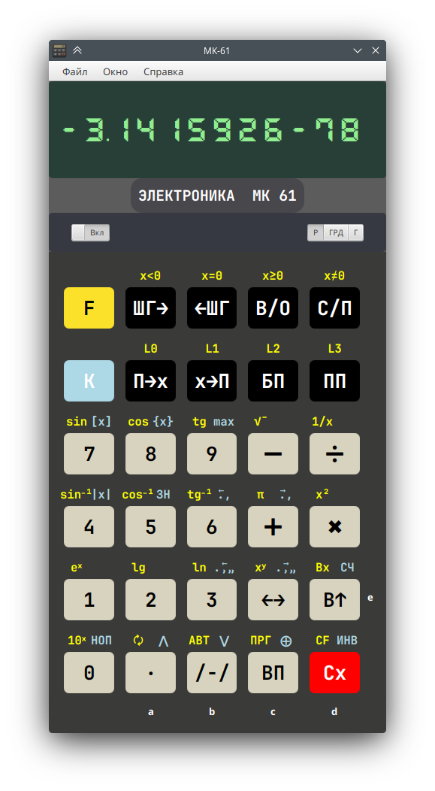
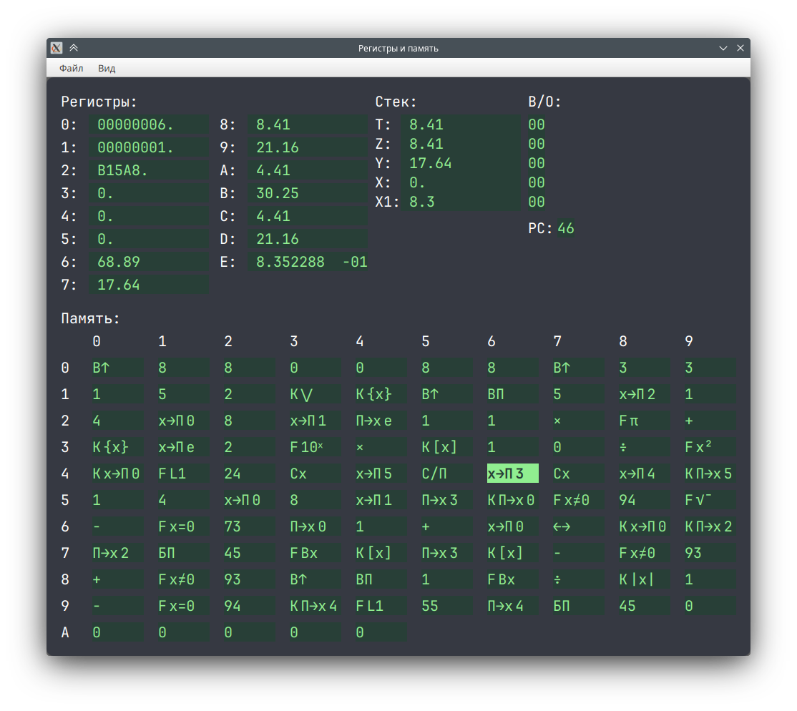
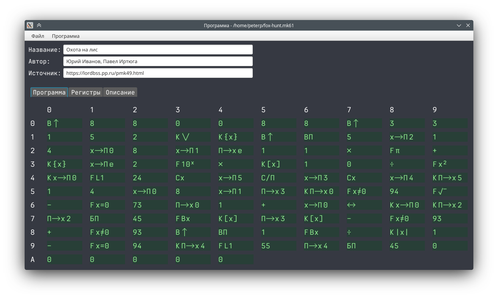

# МК-61

Эмулятор программируемого микрокалькулятора Электроника МК-61.

Ядро эмулятора взято из проекта [https://github.com/cax/pmk-android](https://github.com/cax/pmk-android)

* [Лицензии и копирайт](COPYRIGHT.md)
* [Как построить и запустить](BUILD.md)

## Окно эмулятора

Это окно имитирует внешний вид микрокалькулятора.

## Регистры и память

В этом окне показывается текущее состояние памяти и регистров эмулятора.

С помощью команды `Вид→Показывать мнемоники` (`Ctrl-M`) можно переключаться между показом кодов команд и мнемоник. 
Мнемоники корректно показываются для известных команд. Если программа была загружена из модифицированного файла или 
набрана на калькуляторе с помощью недокументированных сочетаний клавиш, вместо мнемоник могут показываться коды.

## Программа

В этом окне можно производить следующие действия:
- загружать программу из файла;
- сохранять программу в файл;
- считывать коды команд и регистры из памяти эмулятора;
- записывать коды команд и регистры в память эмулятора.

Обратите внимание, что содержимое окна с программой не синхронизируется с эмулятором автоматически. Обмен с эмулятором
проиводится только по командам `Программа→Считать из памяти` (`Ctrl-↓`) и `Программа→Записать в память` (`Ctrl-↑`).

### Сохранение новой программы

Для сохранения программы и регистров в файл первый раз программу нужно сначала набрать в окне калькулятора обычным
способом. Можно также вручную отредактировать или создать файл, но эти варианты здесь не рассматриваются.

После введения программы и данных регистров нужно выбрать пункт меню `Считать из памяти`. Если в окне уже была открыта
программа, коды команд и регистры будут заменены.

После редактирования данных о программе (название, автор и пр.) программу можно сохранить, воспользовавшись пунктами
меню `Файл→Сохранить` или `Файл→Сохранить как`.

### Загрузка программы из файла

Для загрузки программы нужно выбрать пункт меню `Файл→Открыть` (`Ctrl-O`).

Программу можно также загрузить из файла в окне эмулятора. В этом случае она будет автоматически загружена в память,
а также в окно программы. Этим вариантом удобно пользоваться, если не требуется редактирование данных или замена кодов
команд или регистров в файле.

---

# MK-61

Emulator of the Soviet RPN programmable calculator Electronika MK-61.

Emulator core is borrowed from [https://github.com/cax/pmk-android](https://github.com/cax/pmk-android).

* [License and Copyright](COPYRIGHT.md)
* [Build and run](BUILD.md)
