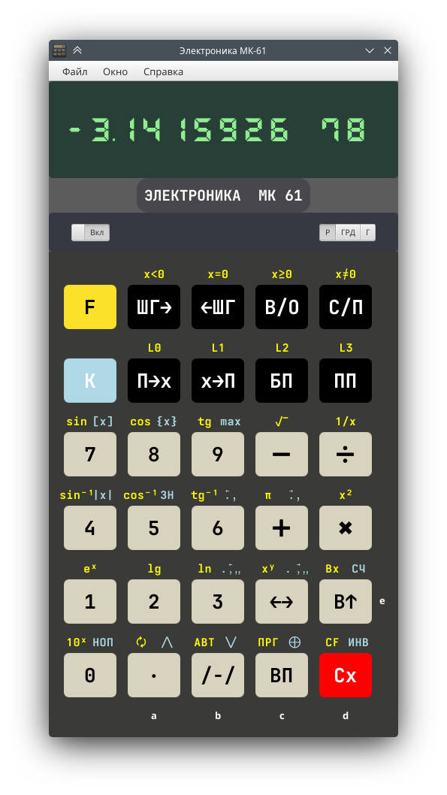

# МК-61

Эмулятор программируемого микрокалькулятора Электроника МК-61.

Ядро эмулятора взято из проекта [https://github.com/cax/pmk-android](https://github.com/cax/pmk-android)

Подробности см. на [сайте проекта](https://www.panteleyev.org/projects/mk61/).

---

# MK-61

Emulator of the Soviet RPN programmable calculator Electronika MK-61.

Emulator core is borrowed from [https://github.com/cax/pmk-android](https://github.com/cax/pmk-android).

More details on [project site](https://www.panteleyev.org/projects/mk61/) (in Russian).
